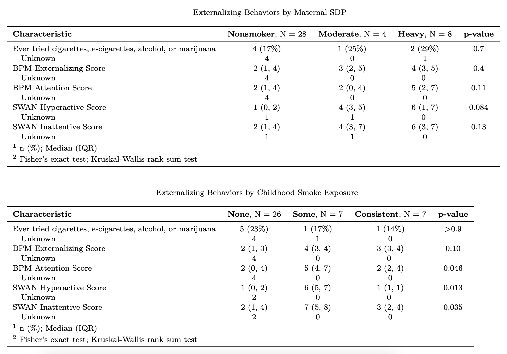

# Exploring the Relationship between Prenatal/Childhood Smoke Exposure and Adolescent Behavior

### Background
The prenatal and postnatal periods represent critical stages of human development, during which environmental factors can shape the child's long-term health and well-being [1]. Among many factors that influence fetal and neonatal development, maternal smoking has emerged as a concern associated with a variety of adverse outcomes, not only affecting the immediate health of the newborn but potentially extending into adolescence and beyond. 

### Methods
This report explores the relationship between prenatal and postpartum smoke exposure and its subsequent impact on teenagers' internalizing and externalizing behaviors. Internalizing behaviors encompass self-regulatory problems, while externalizing behaviors involve outward expressions, such as attention-deficit/hyperactivity disorder (ADHD), conduct disorder, and substance use. Understanding the relationship between prenatal or postnatal smoke exposure and the emergence of these behaviors is crucial for informing public health policies and interventions aimed at fostering healthier outcomes for adolescents. Utilizing data from a cohort of 40 parent-adolescent pairs, this investigation examined the effects of maternal smoking during pregnancy and the first six months postpartum on adolescent outcomes. 

### Results
This report's exploratory data analysis revealed that there wasn't much of an association between smoking during pregnancy and the measured self-regulation behaviors, while there was a stronger association between smoking during pregnancy and the measured externalizing behaviors, particularly the incidence of ADHD. These associations were stronger for childhood smoke exposure than prenatal smoke exposure. The full report can be found [here](report/EDA_report.pdf).

## Files
### R
`preprocessing.R`: Contains the preprocessing steps necessary for exploratory data analysis. Specifically, this script filters for data collected at baseline and it reduces the number of variables from 1,282 to 78 by dropping or summarizing variables. 

### report
`EDA_report.Rmd`: The Rmarkdown version of the Exploratory Data Analysis report, which includes both written text interpretations and raw code used in the analysis. 

`EDA_report.pdf`: The PDF version of the Exploratory Data Analysis report, which includes both written text interpretations and a Code Applendix with the raw code used in the analysis. 

## Dependencies

The following packages were used in this analysis: 

 - Data Manipulation: `tidyverse` 
 - Table Formatting: `gtsummary`, `knitr`, `kableExtra`
 - Data Visualization: `ggplot2`, `RColorBrewer`
