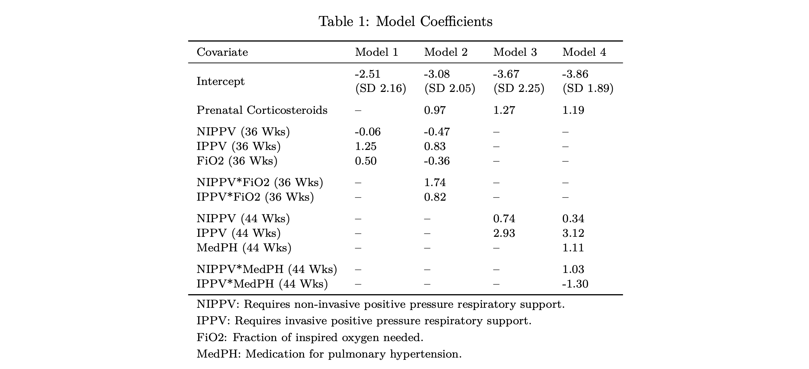

# Predicting Tracheostomy in Infants with sBPD

### Background
Bronchopulmonary dysplasia (BPD) poses a significant challenge in the care of preterm infants, with severe cases often needing tracheostomy. Clinicians grapple with the challenge of determining the optimal timing for tracheostomy placement in neonates with sBPD. This study aims to develop models for predicting tracheostomy in neonates with severe BPD using respiratory parameters at 36 and 44 weeks post-menstrual age (PMA).

### Methods
A multicenter, retrospective case-control study was conducted, involving 996 infants born at less than 32 weeks PMA. Clinical data were collected at birth, 36 weeks PMA, 44 weeks PMA, and at discharge. Multiple imputation addressed missing data and a best subsets algorithm was used for variable selection. Four logistic mixed-effects models were developed, with 30% of observations reserved for validation. Models were evaluated using area under the receiver operating characteristic curve (AUC), Brier score, precision, recall, and F1 score.

### Results
Respiratory support level, fraction of inspired oxygen required, prenatal corticosteroids, and medication of pulmonary hypertension emerged as significant predictors of tracheostomy. The 44-week model outperformed the 36-week model, showing the importance of respiratory parameters closer to discharge. The full report can be found [here](report/model_selection_report.pdf). 

## Files

### R

`eda.R`: Contains the exploratory data analysis steps taken to inform model development. 

### report

`model_selection_report.Rmd`:
The Rmarkdown version of the  report, which includes both written text interpretations and raw code used in the analysis. 

`model_selection_report.pdf`:
The PDF version of the report, which includes both written text interpretations and a Code Applendix with the raw code used in the analysis. 

## Dependencies

The following packages were used in this analysis: 

 - Data Manipulation: `tidyverse` 
 - Table Formatting: `gtsummary`, `knitr`
 - Data Visualization: `corrplot`, `ggplot2`
 - Multiple Imputation: `mice`
 - Best Subsets Variable Selection: `L0Learn`
 - Mixed Effects Modeling: `lme4`
 - Model Evaluation: `pROC`
