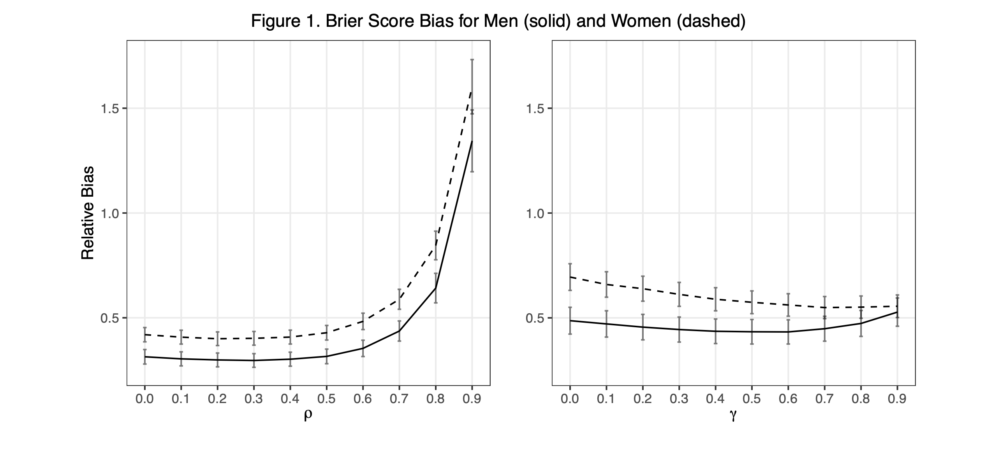

# Evaluating the Performance of Simulated Datasets in Transportability Analysis

### Background
Risk prediction models, such as the Framingham ATP-III model for cardiovascular disease, are crucial for clinical decision-making but may face challenges when applied to populations with different characteristics. Transportability analysis techniques can adjust model performance for these differences, but they require individual-level data from the target population, which may not always be available. Simulating the target population data from summary statistics may be one way to overcome this challenge. Our study evaluated how well simulated data can replicate individual-level target population data in the context of transportability analysis, specifically investigating how important correlation assumptions are when simulating the data.

### Methods
We fit a CVD risk model on Framingham Heart Study data and then conducted transportability analyses using a target population from the National Health and Nutrition Examination Survey (NHANES), a nationally representative dataset that does not contain long-term outcome data on CVD. We assessed the bias of Brier score and AUC estimates derived through transportability analysis using simulated data in comparison to those derived using the individual-level NHANES data. Simulated target population data were generated using NHANES summary statistics and a variety of correlation parameters. 

### Results
Low relative biases were observed, suggesting that using simulated data to conduct transportability analysis is a valid way to estimate Brier scores and AUC in a target population when individual-level data is not available. The simulations that assumed no associations between simulated covariates or that used the associations observed in the source population did not result in substantially lowered performance than simulations using the precise associations observed in the target population. More details can be found in the [report](report/simulation_report.pdf) or the [poster](report/simulation_poster.pdf). 

## Files

### R 

`preprocessing.R`: Contains the steps taken to process the FHS and NHANES datasets. 

`functions.R`:  Contains all functions written for this analysis. 

`simulations.R`: Contains the code used for the simulation study. 

### report

`simulation_report.Rmd`: The Rmarkdown version of the  report, which includes both written text interpretations and raw code used in the analysis. 

`simulation_report.pdf`: The PDF version of the report, which includes both written text interpretations and a Code Appendix with the raw code used in the analysis. 

`simulation_poster.pdf`: A PDF of the poster associated with this project. 

## Dependencies

The following packages were used in this analysis: 

 - Data Manipulation: `tidyverse` 
 - Table Formatting: `gtsummary`, `knitr`, `kableExtra`
 - Data Visualization: `ggplot2`, `gridExtra`
 - Multiple Imputation: `mice`
 - FHS data: `riskCommunicator`
 - NHANES data: `nhanesA`

